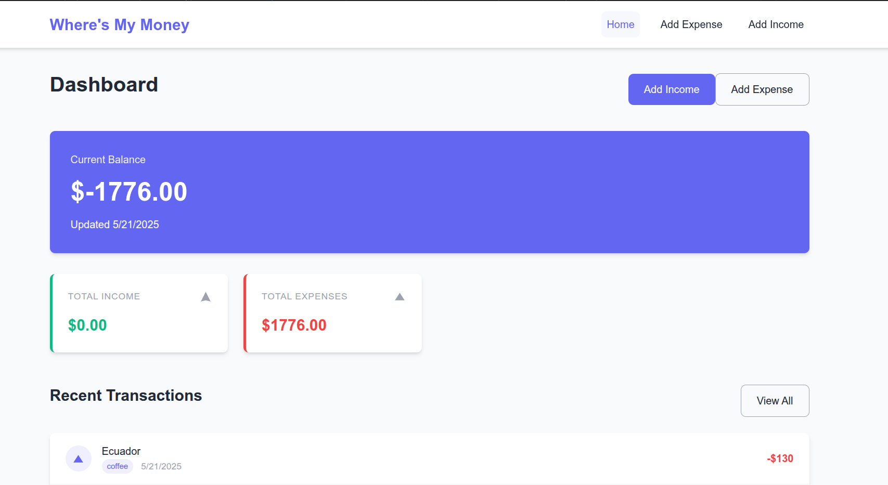
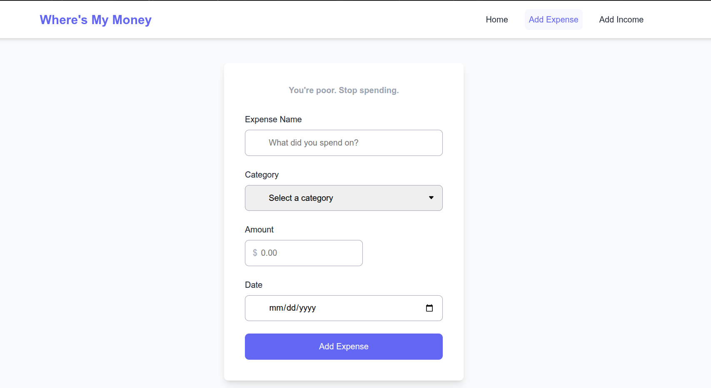
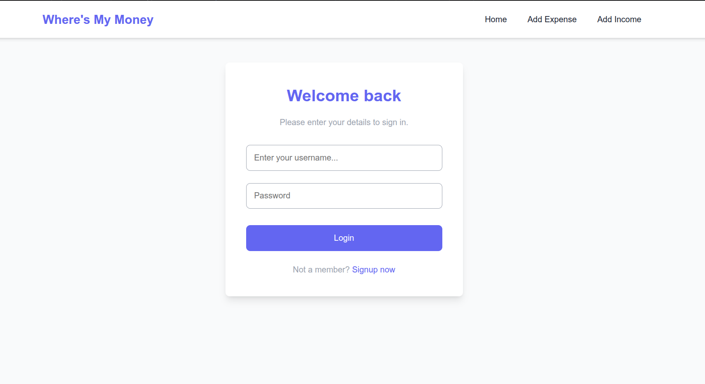
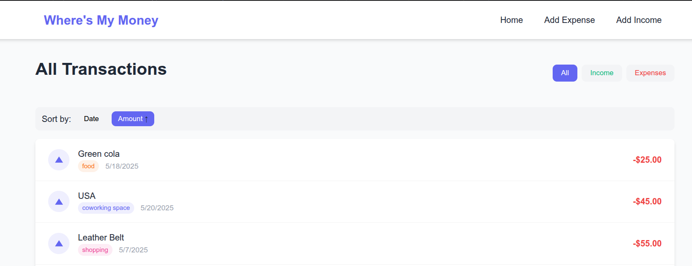

# Expense Tracker - Personal Finance Management Application

A modern, full-stack expense tracking application that helps users manage their finances by tracking income and expenses. Built with React and Flask, this application provides a clean, intuitive interface for financial management.



## Features

- **User Authentication**: Secure login and registration system
- **Dashboard Overview**: At-a-glance view of financial status with current balance, income, and expenses
- **Expense Tracking**: Add and categorize expenses with dates and descriptions
- **Income Recording**: Track income sources and amounts
- **Transaction History**: View recent transactions with detailed information
- **Filtering & Sorting**: Sort transactions by date or amount, filter by transaction type
- **Pagination**: Easily navigate through transaction history
- **Category Management**: Organize expenses into categories with visual indicators
- **Responsive Design**: Works on desktop and mobile devices

## Project Structure

```
Expense-Tracker/
├── frontend/                   # React frontend
│   ├── public/                 # Static files
│   └── src/
│       ├── components/         # Reusable UI components
│       │   ├── Navbar.js       # Navigation bar
│       │   └── ProtectedRoute.js # Auth protection for routes
│       ├── context/
│       │   └── AuthContext.js  # Authentication state management
│       ├── hooks/
│       │   └── useAuthFetch.js # Custom hook for authenticated API calls
│       ├── pages/              # Application views
│       │   ├── Home.js         # Dashboard view
│       │   ├── Login.js        # User login
│       │   ├── Register.js     # User registration
│       │   ├── AddExpense.js   # Add new expense
│       │   └── AllExpenses.js  # View all transactions with pagination
│       ├── App.js              # Main application component
│       └── index.css           # Global styles
├── backend/                    # Flask backend
│   ├── app.py                  # Main application file
│   ├── models.py               # Database models
│   └── routes/                 # API endpoints
│   ├   ├── auth.py             # Authentication routes
│   ├   └── expenses.py         # Expense management routes
│   ├──controllers/


└── README.md                   # Project documentation

```

## Technology Stack

### Frontend

- **React**: JavaScript library for building user interfaces
- **React Router**: Navigation and routing
- **Context API**: State management for authentication
- **CSS3**: Custom styling with responsive design
- **Fetch API**: For data fetching from backend

### Backend

- **Flask**: Python web framework
- **Flask-SQLAlchemy**: ORM for database operations
- **Flask-JWT-Extended**: JWT authentication
- **Flask-CORS**: Cross-origin resource sharing
- **SQLite/PostgreSQL**: Database for data storage
- **Redis**: In-memory data caching for improved performance

## Screenshots

### Dashboard


_The main dashboard shows current balance, income/expense summary, and recent transactions._

### Add Expense


_User-friendly form for adding new expenses with categories and date selection._

### Login Page


_Clean authentication interface for secure access to the application._

### All Transactions


_Paginated view of all transactions with sorting and filtering capabilities._

## Installation and Setup

### Prerequisites

- Node.js (v14 or higher)
- Python (v3.8 or higher)
- npm or yarn

### Frontend Setup

```bash
# Navigate to frontend directory
cd frontend

# Install dependencies
npm install

# Start development server
npm start
```

### Backend Setup

```bash
# Navigate to backend directory
cd backend

# Create virtual environment
python -m venv venv

# Activate virtual environment
# On Windows:
venv\Scripts\activate
# On macOS/Linux:
source venv/bin/activate

# Install dependencies
pip install -r requirements.txt

# Run development server
python app.py
```

## API Endpoints

### Authentication

- `POST /api/register`: Register a new user
- `POST /api/login`: Authenticate a user
- `GET /api/validate-token`: Validate JWT token

### Expenses

- `GET /api/expenses`: Get all expenses for authenticated user
- `POST /api/expenses`: Create a new expense
- `PUT /api/expenses/:id`: Update an existing expense
- `DELETE /api/expenses/:id`: Delete an expense

## Redis Caching

This application uses Redis for caching frequently accessed data to improve performance:

### Cached Resources:

- User expenses (cached for 5 minutes)

### Cache Invalidation:

- Cache is automatically invalidated when expenses are added, updated, or deleted

### Benefits:

- Reduced database load
- Faster API responses
- Improved user experience

### Setup Redis:

```bash
# Install Redis server
# On Ubuntu/Debian:
sudo apt-get install redis-server

# On macOS with Homebrew:
brew install redis

# On Windows, download the Windows port from https://github.com/microsoftarchive/redis/releases

# Start Redis server
redis-server
```

## Future Enhancements

- Budget setting and tracking
- Financial goals and progress tracking
- Data visualization with charts
- Export functionality for reports
- Dark mode
- Multi-currency support
- Recurring transactions

## Contributing

1. Fork the repository
2. Create your feature branch (`git checkout -b feature/amazing-feature`)
3. Commit your changes (`git commit -m 'Add some amazing feature'`)
4. Push to the branch (`git push origin feature/amazing-feature`)
5. Open a Pull Request

## License

This project is licensed under the MIT License - see the LICENSE file for details.
